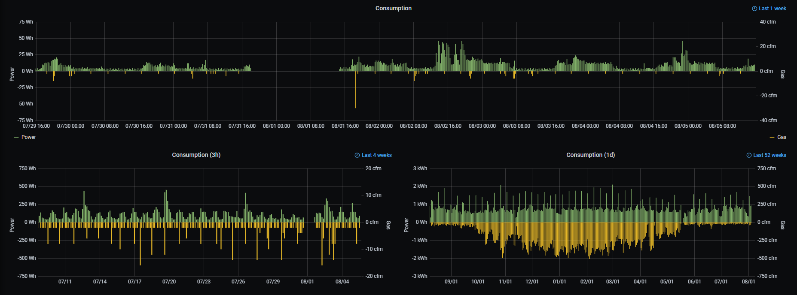

### Purpose
rtlamr-collect provides data aggregation for rtlamr. This tool in tandem with rtlamr provides easy and accurate data collection.

### Requirements
 * GoLang >=1.13 (Go build environment setup guide: http://golang.org/doc/code.html)
 * rtlamr
 * InfluxDB >=1.4.2

### Building
Downloading and building rtlamr-collect is as easy as:

	go get github.com/bemasher/rtlamr-collect

This will produce the binary `$GOPATH/bin/rtlamr-collect`. For convenience it's common to add `$GOPATH/bin` to the path.

### Usage
rtlamr-collect is entirely configured through environment variables:
 * `COLLECT_LOGLEVEL` Specifies what level of logging should be written to stderr, one of Panic, Fatal, Error, Warn, Info, Debug, Trace. Defaults to Info. Trace will print received messages.
 * `COLLECT_INFLUXDB_DRYRUN` Receive data, but do not commit to InfluxDB.
 * `COLLECT_INFLUXDB_HOSTNAME=https://localhost:8086/` InfluxDB hostname to write data to.
 * `COLLECT_INFLUXDB_TOKEN=########` InfluxDB token with write access to bucket. When connecting to a v1.8 instance, the token is of the form: `username:password`
 * `COLLECT_INFLUXDB_ORG=########` InfluxDB organization. When connecting to a v1.8 instance, provide an arbitrary value.
 * `COLLECT_INFLUXDB_BUCKET=bucket_name` InfluxDB bucket to write data to. When connecting to a v1.8 instance, the bucket is of the form: `database/retention_policy`
 * `COLLECT_INFLUXDB_MEASUREMENT=utilities` InfluxDB measurement data will be associated with.
 * `COLLECT_INFLUXDB_CLIENT_CERT=influxdb.crt` (optional) X.509 certificate to use for InfluxDB TLS client authentication
 * `COLLECT_INFLUXDB_CLIENT_KEY=influxdb.key` (optional) X.509 private key to use for InfluxDB TLS client authentication
 * `COLLECT_STRICTIDM=1` Ignores IDM with type 8 and NetIDM with type 7. This should probably always be enabled if you are simultaneously listening to IDM and NetIDM.

At a minimum rtlamr must have the following environment variables defined:
 * `RTLAMR_FORMAT=json` rtlamr-collect input must be json.
 * `RTLAMR_FILTERID=000000000` List your meter id's here separated by commas. This is not strictly necessary, but it is highly recommended. Promiscuously listening to all the meters in a given area is likely to have high series cardinality and will negatively impact InfluxDB's performance.

`rtlamr-collect` should take its input directly from the output of an `rtlamr` instance through a pipe.

```bash
$ rtlamr | rtlamr-collect
```

### Behavior
`rtlamr-collect` reads messages serialized as json from stdin. All new data points are written to the `rtlamr` measurement in InfluxDB with 1s resolution.

All messages include the following tags:
 * `protocol`: One of SCM, SCM+, IDM, NetIDM, R900, R900BCD.
 * `msg_type`: Either differential or cumulative.
 * `endpoint_type`: The meter's commodity type.
 * `endpoint_id`: The meter's serial number.

Meters transmitting `cumulative` messages such as SCM, SCM+, R900, and R900BCD will insert only a single new point per message. These messages include only a single field `consumption`.

Meters transmitting `differential` messages such as IDM and NetIDM will insert a point for each differential interval the message contains, timestamped based on the interval. Fields included are `consumption` and `interval`. State for each meter is maintained so that only data for new intervals is sent to the database. On startup, `rtlamr-collect` will gather this state for all of the previously seen differential meters to avoid duplicating data between runs.

Scaling received data so that it represents real units depends on the meter being monitored and is left as an exercise to the user.

### Other
Data visualization is left as an exercise for the user. I have had a good experience with grafana, however Chronograf and others should work equally well.



### Feedback
If you have any general questions or feedback leave a comment below. For bugs, feature suggestions and anything directly relating to the program itself, submit an issue in github.
